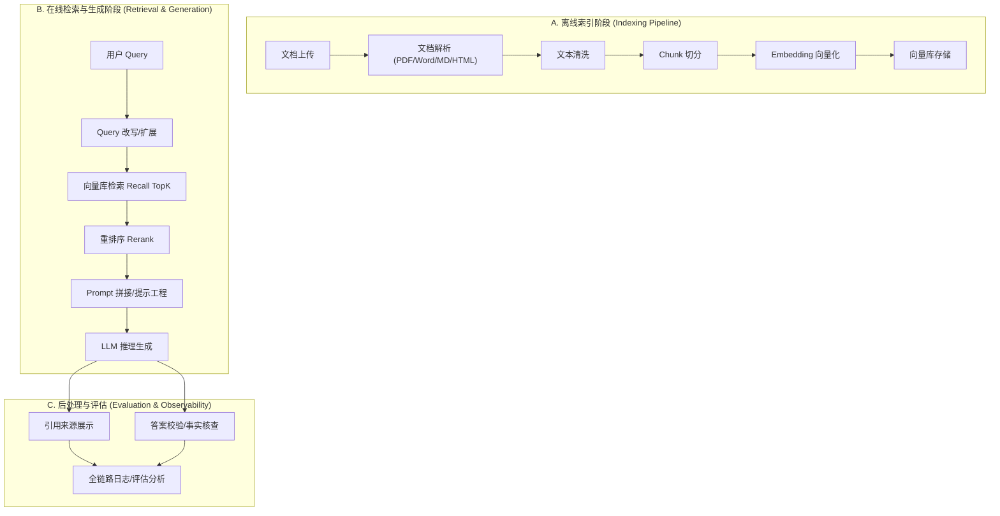

# RAG 全局认知

## 1 RAG 的基本概念

### 1.1 什么是 RAG
RAG（Retrieval-Augmented Generation，检索增强生成） 是一种将外部知识库（如私有文档、行业数据）与 **大语言模型（LLM）** 内置知识相结合的技术框架。它通过在生成答案之前，先从语料库中检索出相关的上下文信息，从而增强模型生成内容的准确性和可靠性。

### 1.2 RAG 解决什么问题

RAG 主要针对 LLM 在实际应用中的三大痛点：
- **信息滞后**：解决模型训练数据存在截止日期，无法掌握最新实时信息的问题。
- **模型幻觉**：通过提供确凿的外部上下文，减少模型“一本正经胡说八道”的情况。
- **行业/私有数据隔离**：LLM 无法学习到企业内部或特定行业的私有文档，RAG 可以动态接入这些数据而无需重新训练模型。

### 1.3 RAG 和微调（Fine-tuning）的区别
两者是优化大模型表现的两种不同路径：

- **工作原理**：
    - 微调是通过在新数据集上重新训练来**更新模型的内部权重**；
    - 而 RAG 不改变模型，只是在输入中提供实时检索到的**外部上下文**。
- **灵活性与更新**：RAG 更加灵活，只需更新外部知识库即可实现知识同步；微调则需要昂贵的重新训练过程。
- **适用场景**：微调更适合调整模型的**语气、格式或特定任务的执行能力**；RAG 更适合需要**动态更新事实知识**的问答场景。

### 1.4 RAG 为什么会产生幻觉
即便使用了 RAG，幻觉依然可能发生，原因通常包括：

- **检索失败**：模型所需的正确信息并未出现在检索到的 TopK 片段中。
- **上下文矛盾**：检索到的多个片段之间存在信息冲突，或与模型内置知识冲突，导致模型推理错误。
- **噪声干扰**：检索回来的内容包含大量无关信息，分散了模型的注意力。
- **生成能力限制**：模型虽然拿到了正确上下文，但无法准确提取或理解其中的事实。

### 1.5 Embedding 和向量数据库

- **Embedding**（嵌入）：将非数值的文本块转化为**高维数值向量**（即“语义指纹”）。其核心作用是**捕捉文本的语义本质**，使得有意义相近的内容在**数学空间中距离更近**。

- **向量数据库**（Vector Store）：专门用于存储和搜索这些 **高维向量（Embeddings）** 而设计的数据库。

    - 它的核心特性是它能**将语义相似性映射为空间的邻近性**，即含义相近的内容在数学空间中的距离也更近，从而支持通过数学计算（如余弦相似度）而非简单的关键词匹配来检索信息。
    - 它利用高效的索引算法（如 HNSW），支持在大规模文档中快速进行相似性搜索，找到与用户问题最相关的文本块。
    - 向量数据库对比参考：./1.1.vector-store.md

### 1.6 核心指标与流程
这几个概念共同构成了 RAG 系统的性能调节链条：

- **Chunk（分块）**：将长文档切分成小块。**分块质量**直接影响 Embedding 的语义密度。块太小会丢失上下文，块太大则会导致检索精度下降（特征被稀释）。
- **TopK**：指系统检索出的前 K 个最相似的块。
- **Recall（召回率）**：衡量系统“找得全不全”。提高 TopK 设定通常能提升召回率，但也可能引入更多噪声。
- **Precision（准确率/精确率）**：衡量系统“找得准不准”，即检索回来的 K 个块中有多少是真正相关的。
- **Rerank（重排序）**：在初步检索后，利用更精细的模型对 TopK 结果进行二次打分。它的作用是在保证召回率的同时，通过优化排名来提升**精确率**，确保最核心的信息排在最前面供 LLM 使用。

总结关系：为了保证 LLM 能够生成好结果，我们需要**合理的 Chunk 策略**来产生**高质量 Embedding**，通过**调整 TopK 保证 召回率**，再通过 **Rerank 过滤噪声提升 准确率**。

## 2 RAG 全局架构图

从“企业知识库系统”的角度，RAG（检索增强生成）可以被视作一套标准的数据处理与在线推理管线。

### 2.1 索引链路（离线预处理阶段）
负责将非结构化文档转化为机器可检索的结构化向量数据。

#### 1> 文档解析模块 (Document Loader/Parser)

- **功能**：用专门的加载器（如 PyPDFLoader 解析 PDF，WebBaseLoader 解析 HTML）将原始文件（PDF、Word、HTML 等）转换为标准化的文档对象。对于复杂排版或含图表的文档，可使用 LlamaParse 等具备 OCR 能力的工具进行深度解析。

- 输入：原始文件流或 URL。
- 输出：标准化 Document 对象（**text_content + metadata 字典**）

- 常见问题：
    - PDF 表格错乱：解析出的数据呈流水账，丢失行列结构。
    - 乱码/OCR 失败：扫描件文字无法提取。

- 排查方法：
    - 日志比对：将解析后的文本落地成文件，人工核对文本完整性
    - 组件替换：针对表格较多的 PDF，从基础解析器（如 PyPDF）切换到更强的解析工具（如 LlamaParse 或 Azure Document Intelligence）。

#### 2> 文本清洗与切分模块 (Text Splitter)

- **功能**：清洗掉网页导航、无关样式等噪点。由于模型上下文窗口有限且为了提升向量检索精度，通常使用 RecursiveCharacterTextSplitter 将文本切分为 500-1000 字符的小块（Chunk），并设置重叠（Overlap）以保持语义连续。

- 输入：解析后的标准化文本。
- 输出：Chunk 列表（带 overlap 重叠区以保持语义连续）。

- 常见问题：
    - 语义断裂：Chunk 太小导致一段话被切成两半，检索时信息不全。
    - 特征稀释：Chunk 太大导致向量表示不精准，检索命中率下降。

- 排查方法：
    - 监控切分长度：检查 Chunk Size 是否在 500-1000 字符的黄金区间。
    - 可视化检查：随机抽取切分结果，检查重叠区（Overlap）是否包含足够的上下文。

#### 3> Embedding 向量化模块

- **功能**：调用模型 API（如OpenAI 的 text-embedding-3 系列模型）将文本 Chunk 转换为高维数值向量（语义指纹）。

- 输入：Chunk 字符串。
- 输出：Float 数组（向量）。

- 常见问题：
    - 维度不匹配：Embedding 模型输出维度与向量库配置不符。
    - API 超时/限流：大规模处理时达到模型厂商限流阈值。

- 排查方法：
    - 向量库校验：检查存储字段的 dimension 配置。
    - 异步重试机制：针对 API 限流，需增加带有指数退避（Exponential Backoff）的重试逻辑。

#### 4> 向量库存储 (Vector Store Service)

- **功能**：持久化向量数据到向量数据库（如Chroma、Pinecone、FAISS），并构建 HNSW 等高效索引以支持语义搜索。

- 输入：向量数据 + 元数据。
- 输出：持久化状态/写入确认。
- 常见问题：查询延迟高（尤其是百万级数据未建索引时）。
- 排查方法：检查向量数据库的索引构建状态和内存占用情况。

### 2.2 检索链路（在线运行阶段）
用户提问时的实时处理流程。

#### 5> 检索模块 (Retriever)

- **功能**：根据用户问题的向量，在向量库中执行相似度搜索，找回 TopK 个最相关的 Chunk。
- 输入：用户查询向量。
- 输出：按相似度得分排序的 List<DocumentChunk>。
- 常见问题：检索漂移（找回的内容看起来相似但语义无关）。
- 排查方法：
    - Debug 相似度分值：检查返回结果的 Score，如果整体分值偏低，需调整检索策略。
    - 混合检索：如果语义搜索不准，尝试结合关键词搜索（BM25）进行混合召回.

- **Query 改写**：原始查询往往模糊或简短，通过 MultiQueryRetriever 利用 LLM 生成多个语义相似的变体，能显著提升找回相关文档的概率。

- Query 改写和检索模块的区别与联系：
    
    - Query 改写负责把话问清楚、问对；
    - 检索模块根据确定的问题，把东西找出来。 

#### 6> 重排序模块 (Reranker)

- **功能**：利用精细模型对初筛的 TopK 结果进行二次打分，确保最相关的核心信息排在首位。
- 输入：初步检索出的 TopN 片段。
- 输出：重新排序后的 TopK（更精简、更准确）。
- 常见问题：显存溢出或延迟增加（Rerank 通常是昂贵的在线计算）。
- 排查方法：监控 Rerank 环节的耗时（Latency），必要时降级为线性搜索。

- **召回、重排序的逻辑关系**：
    
    - **召回**：从海量文档库中快速筛选出 K 个候选片段；
        - 通常采用**向量相似度搜索**（Dense Retrieval）或**关键词搜索**（Sparse Retrieval，如 BM25），在**毫秒级**内完成计算。
    - **重排序**：对召回的初步结果进行精细化的相关性评估，重新排列它们的顺序；
        - 追求精度。通常用更复杂的模型（如 Cross-Encoder），它能更深层地理解 Query 与文档之间的语义匹配，但计算开销大，无法处理全量数据。
    - 他们的协助逻辑是：召回（粗筛）-->重排序（精滤）-->最终交付，是效率和精度的权衡。

#### 7> Prompt 拼接与生成模块 (LLM Service)

- **功能**：将检索出的 TopK 片段作为 Context 与用户 Query 填入 Prompt 模版，请求 LLM 生成答案。
- 输入：模板 + Context + UserQuery。
- 输出：回答字符串。

- 常见问题：
    - 上下文干扰：Context 包含太多噪声，导致模型“迷失”。
    - 模型幻觉：模型忽略 Context，开始胡编乱造。

- 排查方法：
    - 全链路日志打印：务必在控制台打印发给 LLM 的最终 Prompt 字符串，检查上下文是否正确嵌入。
    - 上下文压缩：如果 Context 太长，通过 LLMChainExtractor 提取关键句后再拼接。

#### 8> 引用溯源模块 (Citation Service)

- 功能：在生成的回答中标注来源（如：来自某文档第 X 页）。
- 输入：LLM 回答 + 检索片段的 Metadata。
- 输出：带引用的回答（如：根据文档...）。
- 常见问题：引用张冠李戴（引用的文档 ID 与实际内容不符）。
- 排查方法：在 Pipeline 中传递唯一的 Chunk ID，确保元数据在全链路不丢失。

### 2.3 质量治理（监控与评估）

#### 9> 评估模块 (Evaluation Pipeline)

- 功能：量化 RAG 系统的性能。常用 **RAGAS 框架的“三元组”指标**：
    - 上下文相关性：检索得准不准。
    - 忠实度：回答是否完全基于上下文（防止幻觉）。
    - 答案相关性：是否答非所问。

- 常见问题：评估器（LLM-as-a-Judge）本身可能存在偏见或幻觉。
- 排查方法：人工抽样（Golden Set）比对评估分值，校准 Prompt。

#### 10> 监控与可观测性 (Observability)

- 功能：利用 LangSmith 或 Phoenix 等工具记录全链路 Trace，将 Query 到生成的全过程构建为因果追踪图，快速定位是 “检索没找对” 还是 “LLM 没理解对”。

- 输入：全链路产生的 Request ID 和 Span 数据。
- 常见问题：故障定位难（回答错了，不知道是检索阶段还是生成阶段的问题）。
- 排查方法：查看 因果图谱（Trace Graph），观察是哪一个节点（Node）的输出开始偏离预期。

